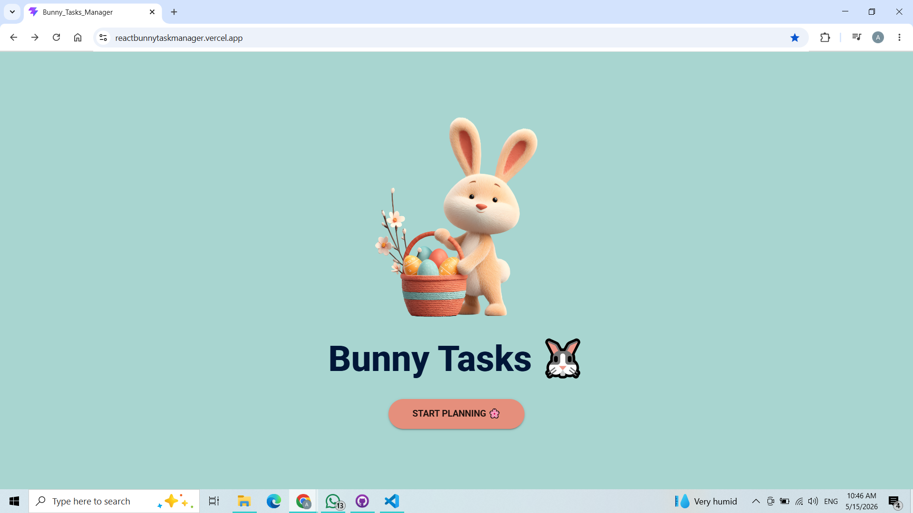
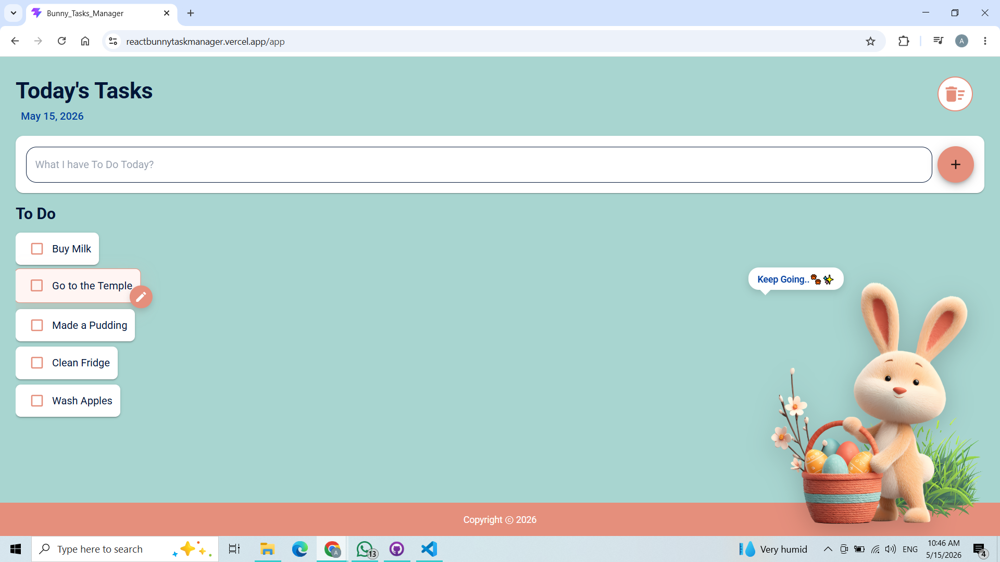
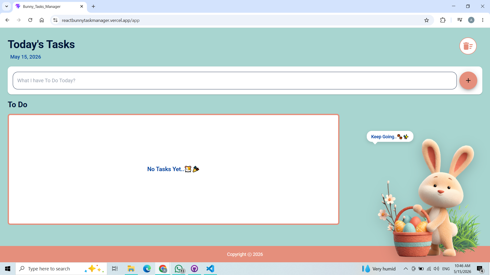

# 🐰 Bunny Task Manager

A modern, cute and responsive **React To-Do List application** designed to help users organize daily tasks with a clean UI, smooth interactions, and persistent storage.

---

## ✨ Features

* 📝 Add new tasks instantly
* ✔ Mark tasks as completed
* ✏ Edit existing tasks
* 🗑 Delete individual tasks
* 🧹 Clear all completed tasks at once
* 💾 Persistent data using Local Storage
* 🎯 Auto-scroll to latest tasks
* 🎨 Smooth UI animations and hover effects
* 🐰 Cute themed UI with bunny-inspired design
* 📱 Fully responsive layout

---

## ✨ Highlights

- React component-based architecture
- React Router navigation
- localStorage persistence
- Material UI styling
- Fully deployed on Vercel

---

## 🛠 Tech Stack

* React.js
* React Router DOM
* Material UI (MUI)
* JavaScript (ES6+)
* CSS3
* Local Storage API

---

## 📂 Project Structure

```

src/
├── Components/
│   ├── Header.jsx
│   ├── Footer.jsx
│   ├── ToDoInput.jsx
│   ├── ToDoList.jsx
│   └── ToDoItem.jsx
│
├── Pages/
│   ├── WelcomePage.jsx
│   └── TodoPage.jsx
│
├── Hooks/
│   ├── useTodos.js
│   └── useTodoEditor.js
│
├── App.jsx
├── main.jsx
└── style.css

```

---

## 🚀 Getting Started

### 1. Clone the repository

```bash
git clone https://github.com/AshiniGunawardhana/React_Bunny_Task_Manager
```

### 2. Install dependencies

```bash
npm install
```

### 3. Run the project

```bash
npm run dev
```

---

## 🌐 Live Demo

> 🚀 Try the app here:  
https://reactbunnytaskmanager.vercel.app/

---

## 📸 Preview

### 🐰 Welcome Page (Bunny Landing Screen)


### ✅ Main Todo Interface


### ✅ Todo Interface - Empty List


---

## 🎯 Learning Outcomes

This project helped me improve:

* React component architecture
* State management using hooks
* Routing with React Router
* UI design using Material UI
* Persistent storage using localStorage
* Code organization in real-world structure

---

## 💡 Future Improvements

* Date boxes & calender improvement
* Task categories / tags
* Due dates and reminders
* Backend integration (MongoDB / Firebase)

---

## 👩‍💻 Author

**Ashini Gunawardhana**
(React Developer-Lerning Phrase)

```
```
